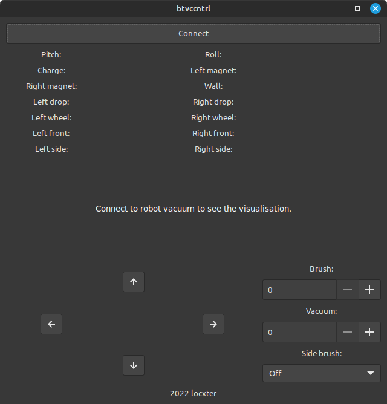

# btvccntrl

## Overview

> This project is **DEPRECATED**, therefore might not be on par with my current coding standards and will not receive any updates now or in the future. Please use my [next generation rewrite (btvccntrl-ng)](https://github.com/locxter/btvccntrl-ng) instead.

This is a GUI program for controlling Neato Botvac D85 robot vacuums. It might also work with other models, but I have not tested that.

## Dependencies

I generally try to minimize dependencies, but I'm a one man crew and can therefore only support Debian-based Linux distributions as I'm running one myself. Anyway, you need to have the following packages installed for everything to work properly:

- GCC, G++, GDB and CMake for building the C++ code. Install them with `sudo apt install build-essential gdb cmake`.
- gtkmm as the used GUI toolkit. Install it with `sudo apt install libgtkmm-3.0-dev`.
- LibSerial as the used serial communication library. Install it with `sudo apt install libserial-dev`.
- cURLpp as the used network communication library. Install it with `sudo apt install curl libcurlpp-dev`.

## How to use it

Simply create a build directory via `mkdir build`, move to it via `cd build` and run CMake via `cmake ..` followed by make via `make`. Then run the executable via `./btvccntrl`.
